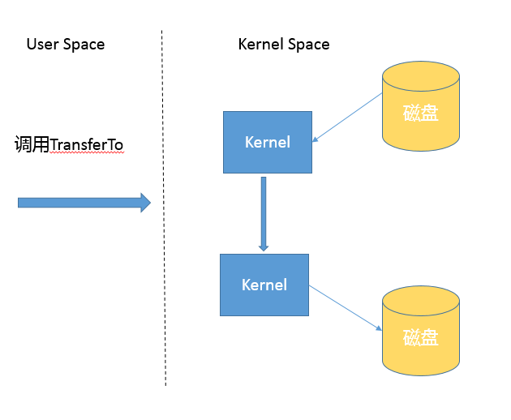

# 如何保证集合是线程安全的?ConcurrentHashMap如何实现高效地线程安全？

- 同步包装器（Collections.synchronizedMap & Collections.synchronizedMap ），通过 Collections 工具类提供的包装方法来获取。

- 同步容器

  - Vector

  - HashTable

并发包（java.util.concurrent）提供的线程安全容器类：

- 并发容器

  - ConcurrentHashMap ，分段 Segment

  - CopyOnWriteArrayList，写入时复制容器

  - CopyOnWriteArraySet，写入时复制容器

- 安全队列（Queue & Deque）Deque 双向队列允许在队列头和尾部进行入队出队操作

  - ConcurrentLinkedQueue，使用非阻塞的方式实现的基于链接节点的无界的线程安全队列，性能非常好。

  - ArrayBlockingQueue，基于数组的有界阻塞队列

  - LinkedBlockingQueue，基于链表的有界阻塞队列。

  - PriorityBlockingQueue，支持优先级的无界阻塞队列，即该阻塞队列中的元素可自动排序。默认情况下，元素采取自然升序排列

  - DelayQueue，一种延时获取元素的无界阻塞队列。

  - SynchronousQueue，不存储元素的阻塞队列。每个put操作必须等待一个take操作，否则不能继续添加元素。内部其实没有任何一个元素，容量是0

  - ArrayDeque，基于数组的双向非阻塞队列。

  - LinkedBlockingDeque，基于链表的双向阻塞队列

- 有序线程安全容器

  - ConcurrentSkipListMap，TreeMap 的线程安全版本

  - ConcurrentSkipListSet，TreeSet 的线程安全版本

## 深入理解

- 理解基本的线程安全工具。

- 理解传统集合框架并发编程中 Map 存在的问题，清楚简单同步方式的不足。

- 梳理并发包内，尤其是 ConcurrentHashMap 采取了那些方式来提高并发表现。

- 掌握 ConcurrentHashMap 演进。

## 知识扩展

### 为什么需要 ConcurrentHashMap？

HashTable 事线程同步安全的，其实现基本就是对 put、get、size 等方法加上 “synchronized” 关键字。如此一来就会导致所有的并发操作都要竞争同一把锁，一个线程进行同步操作时，其他线程只能等待。

HashMap 本身不是线程安全的，并发情况会导致 CPU 占用100% 等问题。

早期 ConcurrentHashMap 的实现：

- 分离锁，内部进行分段（Segment），里面则是 HashEntry 的数组，和 HashMap 类似，哈希相同的条目也是以链表形式存放。

- HashEntry 内部使用 volatile 的 value 字段保证可见性，同时也利用不可变对象的机制改进利用 Unsafe 提供的底层能力，比如 volatile access，去直接完成部分操作。以最优化性能，毕竟 Unsafe 中的很多操作都是 JVM intrinsic 优化过的。


在构造的时候，Segment 的数量由所谓的 concurrentcyLevel 决定，默认是 16，也可以在相应构造函数直接指定。注意，Java 需要它是 2 的幂数值，如果输入是类似 15 这种非幂值，会被自动调整到 16 之类 2 的幂数值。

ConcurrentHashMap get() 操作保证可见性，没有同步逻辑。

```java
public V get(Object key) {
        Segment<K,V> s; // manually integrate access methods to reduce overhead
        HashEntry<K,V>[] tab;
        int h = hash(key.hashCode());
       // 利用位操作替换普通数学运算
       long u = (((h >>> segmentShift) & segmentMask) << SSHIFT) + SBASE;
        // 以 Segment 为单位，进行定位
        // 利用 Unsafe 直接进行 volatile access
        if ((s = (Segment<K,V>)UNSAFE.getObjectVolatile(segments, u)) != null &&
            (tab = s.table) != null) {
           // 省略
          }
        return null;
    }
```

ConcurrentHashMap put() 操作，显示通过二次哈希避免哈希冲突，然后用 Unsafe 调用方式，直接获取相应的 Segment，然后进行线程安全的 put 操作。

```java
 public V put(K key, V value) {
        Segment<K,V> s;
        if (value == null)
            throw new NullPointerException();
        // 二次哈希，以保证数据的分散性，避免哈希冲突
        int hash = hash(key.hashCode());
        int j = (hash >>> segmentShift) & segmentMask;
        if ((s = (Segment<K,V>)UNSAFE.getObject          // nonvolatile; recheck
             (segments, (j << SSHIFT) + SBASE)) == null) //  in ensureSegment
            s = ensureSegment(j);
        return s.put(key, hash, value, false);
    }
```

核心逻辑实现如下的内部方法中：

```java
final V put(K key, int hash, V value, boolean onlyIfAbsent) {
            // scanAndLockForPut 会去查找是否有 key 相同 Node
            // 无论如何，确保获取锁
            HashEntry<K,V> node = tryLock() ? null :
                scanAndLockForPut(key, hash, value);
            V oldValue;
            try {
                HashEntry<K,V>[] tab = table;
                int index = (tab.length - 1) & hash;
                HashEntry<K,V> first = entryAt(tab, index);
                for (HashEntry<K,V> e = first;;) {
                    if (e != null) {
                        K k;
                        // 更新已有 value...
                    }
                    else {
                        // 放置 HashEntry 到特定位置，如果超过阈值，进行 rehash
                        // ...
                    }
                }
            } finally {
                unlock();
            }
            return oldValue;
        }
```

源码分析结论：

- ConcurrentHashMap 会获取再入锁，保证数据一致性，Segment 本来就是基于 ReentrantLock 的扩展实现，所以在并发修改期间，相应 Segment 是被锁定的。

- 在最初阶段，进行重复性的扫描，以确定相应 key 值是否已经在数组里面，进而决定是更新还是放置操作，你可以在代码里看到相应的注释。重复扫描、检测冲突是 ConcurrentHashMap 的常见技巧。

- ConcurrentHashMap 是对单独的 Segment 进行扩容。

## 在 Java 8 和之后的版本中，ConcurrentHashMap 的变化

- 总体结构上，其内部存储结构和 HashMap 结构非常相似，同样是大桶（bucket）数组，然后内部也是一个个所谓的链表结构（bin），不同的粒度要更细致。

- 内部仍然有 Segment 定义，仅仅是为了序列化时的兼容性考虑。

- 不再使用 Segment ，初始化操作简化，修改为 lazy-load 形式，这样可有效避免初始化开销。

- 数据存储利用 volatile 保证可见性。

- 使用 CAS 等操作，在特定场景进行无锁并发操作。

- 使用 Unsafe、LongAdder 之类底层手段，进行极端情况优化。

# Java提供了哪些IO方式？NIO如何实现多路复用？

- java.io（BIO），基于流模型实现，同步阻塞 IO 方式。一个线程处理一个连接，发起和处理IO请求都是同步的

- java.nio（NIO），Java 1.4 引入，提供 Channel、Selector、Buffer 等，可构建多路复用，同步非阻塞 IO 方式。一个线程处理多个连接，发起IO请求是非阻塞的但处理IO请求是同步的

- java.nio 2（NIO2 或 AIO）Asynchronous IO，Java 7 中的改进，引入异步非阻塞 IO 方式，基于事件回调机制。一个有效请求一个线程，发起和处理IO请求都是异步的

## 深入理解

- 基础 API 功能与设计， InputStream/OutputStream 和 Reader/Writer 的关系和区别。 

- NIO、NIO 2 的基本组成。 给定场景，分别用不同模型实现，分析 BIO、NIO 等模式的设计和实现原理。

- NIO 提供的高性能数据操作方式是基于什么原理，如何使用？ 

- 或者，从开发者的角度来看，你觉得 NIO 自身实现存在哪些问题？有什么改进的想法吗？

## 知识扩展

- 区分同步或异步（synchronous / asynchronous），同步是一种可靠有序运行机制，在进行同步操作时，后续的任务是等待当前调用返回，才会进行下一步；异步则相反，其他任务不需要等待当前调用返回，通常依靠事件、回调等机制来实现任务间次序关系。

- 区分阻塞与非阻塞（blocking / non-blocking），在进行阻塞操作时，当前线程会处于阻塞状态，无法从事其他任务，只有当条件就绪才能继续。非阻塞则不管 IO 操作是否结束，直接返回，相应操作在后台继续处理。

多路复用：IO多路复用，就是通过一种机制，一个进程可以监视多个描述符，一旦某个描述符就绪（一般是读就绪或者写就绪），能够通知程序进行相应的读写操作。

### java.io

- IO 不只是对文件的操作。适用场景：Socket 通信等；

- InputStream / OutputStream （输入、输出流）用于读写字节。适用场景：资源文件；

- Read / Writer 则是用于操作字符流，增加了字符编解码功能。适用场景：从文件中读取或写入文本信息。

- BufferedOutputStream 利用缓冲区，将批量数据进行一次操作，别忘了 flush，避免频繁的磁盘读写，提高 IO 处理效率。

- IO 工具类都实现 Closeable 接口来进行资源释放。比如：打开 FileInputStream 它就会获取相应的文件描述符（FileDescriptor），利用 try-with-resources、try-finally 机制保证 FileInputStream 明确关闭，然后 文件描述符也会随之是笑，否则将导致资源无法释放。

  

### java NIO 主要组成部分

- Buffer（缓冲区），高效的数据容器，是个抽象类，除了布尔类型，所有原始类型都有相应的 Buffer 实现。

- Channel（通道），Channel 表示与诸如硬件设备，文件，网络套接字或能够执行一个或多个不同IO操作（例如读取或写入）的程序组件实体的开放连接。类似在 Linux 之类操作系统上看到的[文件描述符](https://zh.wikipedia.org/wiki/%E6%96%87%E4%BB%B6%E6%8F%8F%E8%BF%B0%E7%AC%A6)，是 NIO 中被用来支持批量式 IO 操作的一种抽象。File 或者 Socket 通常被认为是比较高层次的抽象，Channel 则是更加操作系统底层的一种抽象，使得 NIO 得以充分利用现代操作系统底层机制，获得特定场景的性能优化。

- Selector（多路复用器），是 NIO 实现多路复用的基础，提供一种高效的机制，可以检测到注册在 Selector 上的多个 Channel 中，是否有 Channel 处于就绪状态，进而实现单线程多 Channel 的高效管理。Selector 同样是基于底层操作系统机制，不同模式、不同版本都存在区别。

- ChartSet，提供 Unicode 字符串定义，NIO 也提供相应的编解码器。`Charset.defaultCharset().encode("Hello world!"));`

### NIO 能解决什么问题？

为什么需要NIO？为什么需要多路复用？

设想，我们需要实现一个服务器应用，只简单要求能够同时服务多个客户端请求即可。

```java
public class DemoServer extends Thread {
    private ServerSocket serverSocket;
    public int getPort() {
        return  serverSocket.getLocalPort();
    }
    public void run() {
        try {
            serverSocket = new ServerSocket(0);
            while (true) {
                Socket socket = serverSocket.accept();
                RequestHandler requestHandler = new RequestHandler(socket);
                requestHandler.start();
            }
        } catch (IOException e) {
            e.printStackTrace();
        } finally {
            if (serverSocket != null) {
                try {
                    serverSocket.close();
                } catch (IOException e) {
                    e.printStackTrace();
                }
                ;
            }
        }
    }
    public static void main(String[] args) throws IOException {
        DemoServer server = new DemoServer();
        server.start();
        try (Socket client = new Socket(InetAddress.getLocalHost(), server.getPort())) {
            BufferedReader bufferedReader = new BufferedReader(new                   InputStreamReader(client.getInputStream()));
            bufferedReader.lines().forEach(s -> System.out.println(s));
        }
    }
 }
// 简化实现，不做读取，直接发送字符串
class RequestHandler extends Thread {
    private Socket socket;
    RequestHandler(Socket socket) {
        this.socket = socket;
    }
    @Override
    public void run() {
        try (PrintWriter out = new PrintWriter(socket.getOutputStream());) {
            out.println("Hello world!");
            out.flush();
        } catch (Exception e) {
            e.printStackTrace();
        }
    }
 }
```

引入线程池机制避免浪费

```java
serverSocket = new ServerSocket(0);
executor = Executors.newFixedThreadPool(8);
 while (true) {
    Socket socket = serverSocket.accept();
    RequestHandler requestHandler = new RequestHandler(socket);
    executor.execute(requestHandler);
}
```


通过固定大小的线程池，负责管理工作线程，避免平凡创建和销毁；

如果客户端连接数量不是很多，这种方式能工作的很好；但如果客户端连接数量随着增加越来越多，线程上下文切换开销会在高并发时很严重，这就是同步阻塞方式的低扩展劣势。

NIO 引入多路复制机制

```java
public class NIOServer extends Thread {
    public void run() {
        try (Selector selector = Selector.open();
             ServerSocketChannel serverSocket = ServerSocketChannel.open();) {// 创建 Selector 和 Channel
            serverSocket.bind(new InetSocketAddress(InetAddress.getLocalHost(), 8888));
            serverSocket.configureBlocking(false);
            // 注册到 Selector，并说明关注点
            serverSocket.register(selector, SelectionKey.OP_ACCEPT);
            while (true) {
                selector.select();// 阻塞等待就绪的 Channel，这是关键点之一
                Set<SelectionKey> selectedKeys = selector.selectedKeys();
                Iterator<SelectionKey> iter = selectedKeys.iterator();
                while (iter.hasNext()) {
                    SelectionKey key = iter.next();
                   // 生产系统中一般会额外进行就绪状态检查
                    sayHelloWorld((ServerSocketChannel) key.channel());
                    iter.remove();
                }
            }
        } catch (IOException e) {
            e.printStackTrace();
        }
    }
    private void sayHelloWorld(ServerSocketChannel server) throws IOException {
        try (SocketChannel client = server.accept();) {          client.write(Charset.defaultCharset().encode("Hello world!"));
        }
    }
   // 省略了与前面类似的 main
}
```

- 首先，通过 Selector.open() 创建一个 Selector，作为类似调度员的角色。

- 然后，创建一个 ServerSocketChannel，并且向 Selector 注册，通过指定 SelectionKey.OP_ACCEPT，告诉调度员，它关注的是新的连接请求。 注意，为什么我们要明确配置非阻塞模式呢？这是因为阻塞模式下，注册操作是不允许的，会 抛出 IllegalBlockingModeException 异常。

- Selector 阻塞在 select 操作，当有 Channel 发生接入请求，就会被唤醒。

- 在 sayHelloWorld 方法中，通过 SocketChannel 和 Buffer 进行数据操作，在本例中是发送 了一段字符串。

NIO 利用单线程轮训事件机制，定位就绪的 Channel 来决定做什么，仅 select 阶段是阻塞的，可以避免大量客户端连接时，频繁的线程切换带来的问题。

NIO2 异步 IO 模式，利用事件和回调，处理Accept、Read等操作。

```java
AsynchronousServerSocketChannel serverSock =        AsynchronousServerSocketChannel.open().bind(sockAddr);
serverSock.accept(serverSock, new CompletionHandler<>() { // 为异步操作指定 CompletionHandler 回调函数
    @Override
    public void completed(AsynchronousSocketChannel sockChannel, AsynchronousServerSocketChannel serverSock) {
        serverSock.accept(serverSock, this);
        // 另外一个 write（sock，CompletionHandler{}）
        sayHelloWorld(sockChannel, Charset.defaultCharset().encode
                ("Hello World!"));
    }
  // 省略其他路径处理方法...
});
```

## 相关

IO 多路复用通过一种机制，一个进程可以监视多个描述符，一旦某个描述符就绪（一般是读就绪或者写就绪），能够通知程序进行相应的读写操作。

[了解Unix网络编程5种I/O模型]([https://www.cnblogs.com/diegodu/p/6823855.html](https://www.cnblogs.com/diegodu/p/6823855.html)

# Java 有几种文件拷贝方式？哪一种最高效？

- java.io 为源文件构建一个 FileInputStream 读取，再为目标文件构建一个 FileOutputStrean 完成写入。

```java
public static void copyFileByStream(File source, File dest) throws
     IOException {
 try (InputStream is = new FileInputStream(source);
      OutputStream os = new FileOutputStream(dest);){
     byte[] buffer = new byte[1024];
     int length;
     while ((length = is.read(buffer)) > 0) {
         os.write(buffer, 0, length);
     }
 }
}
```

- java.nio 提供的 transferTo 或 transferFrom 方法实现

```java
public static void copyFileByChannel(File source, File dest) throws
        IOException {
    try (FileChannel sourceChannel = new FileInputStream(source)
            .getChannel();
         FileChannel targetChannel = new FileOutputStream(dest).getChannel
                 ();){
        for (long count = sourceChannel.size() ;count>0 ;) {
            long transferred = sourceChannel.transferTo(
                    sourceChannel.position(), count, targetChannel);            sourceChannel.position(sourceChannel.position() + transferred);
            count -= transferred;
        }
    }
 }
```

- java 标准类库也提供了几种 Files.copy() 的实现。

    java.nio.file.Files

```java
 public static Path copy(Path source, Path target, CopyOption... options)
 public static long copy(InputStream in, Path target, CopyOption... options)
 public static long copy(Path source, OutputStream out)
```

对于 Copy 的效率，这个其实与操作系统和配置情况相关，NIO transferTo/From 方式可能更快，因为它利用现代操作系统底层机制，避免不必要拷贝和上下文切换。

## 深入理解

- 不同的 copy 方式，底层机制有什么区别？

- 为什么零拷贝（zero-copy）可能有性能优势？

- Buffer 分类使用？

- Direct Buffer 对垃圾收集等方面影响与实践选择？

## 知识扩展

### 什么是零拷贝？

简单的说零拷贝技术就是一种避免 CPU 将数据从一块存储拷贝到另一块存储的技术。

### 为什么需要零拷贝？

操作系统将数据从应用将应用程序地址空间的缓冲区拷贝到内核空间的缓冲区，站在操作系统层面这样子接口简单，但是以牺牲系统性能为代价的。原因是数据拷贝操作不单单是占用 CPU 时间片，还占用一定的内存带宽。

### 拷贝实现机制分析

现代计算机操作系统通常将虚拟内存分离为内核空间和用户空间。这种分离主要用于提供内存保护和硬件保护，防止恶意或错误的软件行为。

用户态空间（User Space），是应用软件和一些驱动程序执行的存储区域。

内核态空间（Kernel Space），内核空间严格保留用于运行特权操作系统内核，内核扩展和大多数设备驱动程序。


应用读取数据是先从内核态将数据从磁盘读取到内核缓存，在切换到用户态将数据从内核缓存读取到用户缓存，这种操作进行了多次上下文切换，带来一定额外开销，可能会降低 I/O 效率。

基于 NIO transferTo 实现方式，在 Linux 和 Unix 上，则会使用到零拷贝技术，数据传输不需要用户态参与，省去了上下文切换的开销和不必要的内存拷贝，进而可能提高应用拷贝性能。

TransferTo 传输过程：



### Java IO/NIO 源码结构

```java
public static Path copy(Path source, Path target, CopyOption... options)
    throws IOException
```

```java
public static long copy(InputStream in, Path target, CopyOption... options)
    throws IOException
```

```java
public static long copy(Path source, OutputStream out) 
    throws IOException
```

专栏中提到“后面两种 copy 实现，能够在方法实现里直接看到使用的是 InputStream.transferTo()，你可以直接看源码，其内部实现其实是 stream 在用户态的读写；” 在 jdk8 版本中确实没找到

```java
    public static Path copy(Path source, Path target, CopyOption... options)
        throws IOException
    {
        FileSystemProvider provider = provider(source);
        if (provider(target) == provider) {
            // same provider
            provider.copy(source, target, options);
        } else {
            // different providers
            CopyMoveHelper.copyToForeignTarget(source, target, options);
        }
        return target;
    }
```

我把源码分析过程简单记录如下，JDK 的源代码中，内部实现和公共 API 定义也不是可以能够简单关联上的，NIO 部分代码甚至是定义为模板而不是 Java 源文件，在 build 过程自动生成源码，下面顺便介绍一下部分 JDK 代码机制和如何绕过隐藏障碍。

- 首先，直接跟踪，发现 FileSystemProvider 只是个抽象类，阅读它的源码能够理解到，原来文件系统实际逻辑存在于 JDK 内部实现里，公共 API 其实是通过 ServiceLoader 机制加载一系列文件系统实现，然后提供服务。

- 我们可以在 JDK 源码里搜索 FileSystemProvider 和 nio，可以定位到 sun/nio/fs，我们知道 NIO 底层是和操作系统紧密相关的，所以每个平台都有自己的部分特有文件系统逻辑。


- 省略掉一些细节，最后我们一步步定位到 UnixFileSystemProvider → UnixCopyFile.Transfer，发现这是个本地方法。

- 最后，明确定位到 UnixCopyFile.c ，其内部实现清楚说明竟然只是简单的用户态空间拷贝！

到这里得出一个结论，常见的 copy 方法不是利用 transTo，而是利用本地技术实现的用户空间拷贝。

如何提高类似拷贝等 IO 操作的性能，有一些宽泛的原则：

- 在程序中，使用缓存等机制，合理减少 IO 次数（在网络通信中，如 TCP 传输，window 大小也可以看作是类似思路）。

- 使用 transferTo 等机制，减少上下文切换和额外 IO 操作。

- 尽量减少不必要的转换过程，比如编解码；对象序列化和反序列化，比如操作文本文件或者网络通信，如果不是过程中需要使用文本信息，可以考虑不要将二进制信息转换成字符串，直接传输二进制信息。

### 掌握 NIO Buffer

Buffer 是 NIO 操作数据的基本工具，Java 为每个原始数据类型提供了相应的 Buffer 实现（布尔除外），尤其是涉及 Direct Buffer 等使用，因为其在垃圾收集等方面特殊性，更要重点掌握。


Buffer 的几个基本属性：

- capcity，表示 Buffer 的缓冲区大小，也就是数组长度。

- position，要操作数据起始位置。

- limit，操作限额，默认是 capcity 大小。

- mark，记录上次 position 的位置，默认是0

Buffer 的基本操作：

- 我们创建了一个 ByteBuffer，准备放入数据，capcity 当然就是缓冲区大小，而 position 就是 0，limit 默认就是 capcity 的大小。

- 当我们写入几个字节的数据时，position 就会跟着水涨船高，但是它不可能超过 limit 的大小。

- 如果我们想把前面写入的数据读出来，需要调用 flip 方法，将 position 设置为 0，limit 设置为以前的 position 那里。

- 如果还想从头再读一遍，可以调用 rewind，让 limit 不变，position 再次设置为 0。

### Direct Buffer 和垃圾收集

使用 Direct Buffer 开辟的是堆外内存，需要清楚它对内存和 JVM 参数的影响。

- Direct Buffer，如果我们看 Buffer 的方法定义，你会发现它定义了 isDirect() 方法，返回当前 Buffer 是否是 Direct 类型。这是因为 Java 提供了堆内和堆外（Direct）Buffer，我们可以以它的 allocate 或者 allocateDirect 方法直接创建。

- MappedByteBuffer，它将文件按照指定大小直接映射为内存区域，当程序访问这个内存区域时将直接操作这块儿文件数据，省去了将数据从内核空间向用户空间传输的损耗。我们可以使用

在实际使用中，Java 会尽量对 Direct Buffer 仅做本地 IO 操作，对于很多大数据量的 IO 密集操作，可能会带来非常大的性能优势，因为：

- Direct Buffer 生命周期内内存地址都不会再发生更改，进而内核可以安全地对其进行访问，很多 IO 操作会很高效。

- 减少了堆内对象存储的可能额外维护工作，所以访问效率可能有所提高。

**但是请注意，Direct Buffer 创建和销毁过程中，都会比一般的堆内 Buffer 增加部分开销，所以通常都建议用于长期使用、数据较大的场景。**

## 相关资料

[Java NIO Buffer](http://tutorials.jenkov.com/java-nio/buffers.html)

[Zero-Copy](https://www.linuxjournal.com/article/6345)

# 谈谈接口和抽象类有什么区别？

- 接口类，用 interface 关键字修饰，由抽象方法和全局常量组成；不能包含非常量成员，意味着所有的 field 都是 public static final 修饰，没有任何非静态方法（要么是抽象方法和静态方法）；利用接口可以达到 API 定义与实现的分离；接口对象利用子类（实现类）对象的向上转型完成实例化操作。

- 抽象类，用 abstract 关键字修饰类和方法（抽象方法没有方法体），主要实现代码重用的目的，除了不能单独实例化，与普通 Java 类没有区别。抽象类用于抽取 Java 类的共用方法或者是共同的成员变量，通过集成的方式达到代码复用的目的。抽象类不能用 final 修饰；抽象类中定义的内部子类一定是 static ；继承抽象类的子类必须覆写抽象方法。

## 深入理解

- 对于 Java 的基本元素的语法是否理解准确。能否定义出语法基本正确的接口、抽象类或者相关继承实现，涉及重载（Overload）、重写（Override）更是有各种不同的题目。 

- 在软件设计开发中妥善地使用接口和抽象类。你至少知道典型应用场景，掌握基础类库重要接口的使用；掌握设计方法，能够在 review 代码的时候看出明显的不利于未来维护的设计。 

- 掌握 Java 语言特性演进。现在非常多的框架已经是基于 Java 8，并逐渐支持更新版本，掌握相关语法，理解设计目的是很有必要的。

## 知识扩展

Java 不支持多继承，但可以实现多个 Java 接口，弥补了单根继承缺陷。

Java 8 增加了函数式编程支持（function interface），也就是说只有一个抽象方法的接口。使用@FunctionInterface 标记。

Java 8 对接口增加对 default method 的支持。Java 9 之后甚至可以定义 private default method。Java 8 中添加的一系列 default method，主要是正价 Lambda、Stream 相关功能。

```java
public interface Collection<E> extends Iterable<E> {
     /**
     * Returns a sequential Stream with this collection as its source 
     * ...
     **/
     default Stream<E> stream() {
         return StreamSupport.stream(spliterator(), false);
     }
  }
```

面向对象基本要素：封装、继承、多态

封装：隐藏内部事务实现细节，提高应用安全性和简化编程。

继承：代码复用的基础机制，但继承可以看做是非常紧耦合的关系。

多态：涉及重写（override）、重载（overload）、向上转型，重写是父子类相同名称和参数的方法，不同的实现；重载是相同名称的方法，但参数不同，本质上方法签名是不一样的；

方法名称 和 参数一致，但返回值不同，这不算重载，编译会报错的如下所示：

```java
public int doSomething() {
    return 0;
}
// 输入参数不同，意味着方法签名不同，重载的体现
public int doSomething(List<String> strs) {
    return 0;
}
// return 类型不一样，编译不能通过
public short doSomething() {
    return 0;
}
```

S.O.L.I.D 原则：

- 单一职责（Single Responsibility）

- 开关原则（Open-Close，Open for extension, Close for modification），设计要对扩展开放，关闭修改。

- 里氏替换（Liskov Substitution），凡是可以用父类的地方，都可以用子类替换。

- 接口分离（Interface Segregation），若一个接口定义太多方法，子类很可能面临两难，只有部分方法对它是有意义的，就破坏了程序的内聚性。

- 依赖反转（Dependency Inversion），解耦合。实体应该依赖于抽象而非实现。也就是所高层次模块，不应该依赖低层次模块，而是应该基于抽象。

## 开关原则实践

案例

```java
public class VIPCenter {
  void serviceVIP(T extend User user>) {
     if (user instanceof SlumDogVIP) {
        // 穷 X VIP，活动抢的那种
        // do somthing
      } else if(user instanceof RealVIP) {
        // do somthing
      }
      // ...
  }
```

改造后

```java
public class VIPCenter {
   private Map<User.TYPE, ServiceProvider> providers;
   void serviceVIP(T extend User user） {
      providers.get(user.getType()).service(user);
   }
 }
 interface ServiceProvider{
   void service(T extend User user) ;
 }
 class SlumDogVIPServiceProvider implements ServiceProvider{
   void service(T extend User user){
     // do somthing
   }
 }
 class RealVIPServiceProvider implements ServiceProvider{
   void service(T extend User user) {
     // do something
   }
 }
```

# 设计模式


## 深入理解

- 手写一个典型的设计模式实现。

- 典型的设计模式使用，结合标准库和主流开源框架。

## Spring 中的设计模式

- BeanFactory 和 ApplicationContext 应用了工厂模式。

- Bean 创建中，Spring 为不同 scope 定义的对象，提供了单例模式和原型模式实现。

- Spring AOP ，使用了代理模式、装饰器模式、适配器模式。

- 监听器则是典型的观察者模式

- Spring 中 JdbcTemplate 则使用了模板模式。

## Java 中的设计模式

IO 框架，InputStream 是一个抽象类，标准类库中提供了 FileInputStream、ByteArrayInputStream 等各种不同的子类，分别从不同角度对 InputStream 进行了功能扩展，这是典型的装饰器模式应用案例。


### 如何识别装饰器模式呢？

只需要关注类的构造函数以**相同的抽象类或接口**作为输入参数。

装饰器模式本质上是包装同类型实例，我们对目标对象的调用，往往会通过**包装类**覆盖过的方法，迂回调用被包装的实例，这就可以很自然地实现增加额外逻辑的目的，也就是所谓的“装饰”。

# synchronized和ReentrantLock有什么区别呢？

synchronized 是 Java 内建的同步机制，提供了互斥的语义和可见性。当一个线程已经获取当前锁时，其他试图获取的线程只能等待或阻塞在那里。synchronized 代码块是由一对儿 monitorenter/monitorexit 指令实现的，Monitor 对象是同步的基本实现单元。

ReentrantLock 再入锁，语义和 synchronized 基本相同。再入锁通过代码直接调用 lock() 方法获取，代码书写更加灵活。编码中明确调用 unlock() 方法释放锁，不然一直持有该锁。再入锁可看做是 synchronized 的增强版，比如可以控制公平性（fairness）或则利用定义条件等。

随着版本的改进两则性能不能一概而论。

## 重点掌握

- 理解线程安全。

- synchronized 和 ReentrantLock 等机制的基本使用与案例。

- 掌握 synchronized 、ReentrantLock 底层实现；理解锁膨胀、降级；理解偏斜锁、自旋锁、轻量级锁、重量级锁

- 掌握并发包 java.util.concurrent.lock 各种不同实现和案例分析。

## 知识扩展

线程安全是一个多线程环境下正确性的概念，也就是保证多线程环境下共享的、可修改的状态的正确性，这里的状态指的是数据。

### 如何保证线程安全

- 封装，将对象内部状态隐藏保护起来。

- 不可变，final 和 immutable，目前还没有原生的不可变。

### 线程安全的基本特征

- 原子性，操作过程中不会被其他线程干扰，一般通过同步机制实现。

- 可见性，当一个线程修改了一个共享变量，其状态能够立刻被其他线程知道。volatile 保证了可见性。

- 有序性，避免指令重排序。

### RenntrantLock

什么是再入？就是对锁获取粒度的概念，也就是所一个线程试图获取一个它已经获取过的锁时，这个获取动作就自动成功。锁的持有是以线程为单位而不是基于调用次数。Java 锁实现强调再入行是为了和并行线程（pthread）的行为进行区分。

再入锁可以设置公平性（fairness）`ReentrantLock fairLock = new ReentrantLock(true);`

### 关于再入锁的公平性

公平性是指竞争场景中，当公平性设置为真时，会倾向于将锁赋予等待时间最久的线程。

目的是为了减少线程“饥饿”，也就是解决个别线程长期等待锁，但始终无法获取的情况。

**Java 默认的调度策略很少导致“饥饿”发生，若要保证公平性则会引入额外开销，自然会导致吞吐量下降。** 建议在只有在程序确实有公平性需要的时候，才有必要指定它。

### ReentrantLock 比Synchronized 提供的精细化操作。

- 带超时的获取锁尝试。

- 可判断是否有线程，或某个特定线程，在排队等待获取锁。

- 可以响应中断请求。

# synchronized底层如何实现？什么是锁的升级、降级？

在 Java 6 之前，Monitor 的实现完全是依靠操作系统内部的互斥锁，因为需要进行用户态到内核态的切换，所以同步操作是一个无差别的重量级操作。

现代的（Oracle）JDK 中，JVM 提供了三种不同的 Monitor 实现，也就是常说的三种不同的锁：偏斜锁（Biased Locking）、轻量级锁和重量级锁，大大改进了其性能。

所谓锁的升级、降级，就是 JVM 优化 synchronized 运行的机制，当 JVM 检测到不同的竞争状况时，会自动切换到适合的锁实现，这种切换就是锁的升级、降级。

偏斜锁可以降低无竞争开销，当没有竞争出现时，默认使用偏斜锁。JVM 利用 CAS 操作，在对象头上的 Mark Word部分设置线程 ID，表示这个对象偏向于当前线程，并不真正涉及互斥锁。

如果有另外的线程试图锁定某个已经被偏斜过的对象，JVM 就需要撤销（revoke） 偏斜锁，并切换到轻量级锁实现。

轻量级锁依赖 CAS 操作 Mark Word 来试图获取锁，若重试成功，就使用普通的轻量级锁；否则，升级为重量级锁。

## 自旋锁

自旋锁是尝试获取锁的线程不会立即阻塞，采用循环的方式去获取锁，好处是减少了上下文切换，缺点是消耗cpu。

为什么会提出自旋锁？因为互斥锁，在线程的睡眠和唤醒都是复杂而昂贵的操作，需要大量的CPU指令。如果互斥仅仅被锁住是一小段时间，  用来进行线程休眠和唤醒的操作时间比睡眠时间还长，更有可能比不上不断自旋锁上轮询的时间长。

自旋锁只有在多核CPU上有效果，单核毫无效果，只是浪费时间。

1.基于乐观情况下推荐使用，即锁竞争不强，锁等待时间不长的情况下推荐使用  
2.单cpu无效，因为基于cas的轮询会占用cpu,导致无法做线程切换  
3.轮询不产生上下文切换，如果可估计到睡眠的时间很长，用互斥锁更好

# 一个线程两次调用start()方法会出现什么情况？

两次调用 start() 方法，Java 的线程事不允许出现的，二次调用只能抛出 IllegalThreadStateException 异常。

线程生命周期的不同状态，java.lang.Thread.State 中定义如下：

- NEW，尚未启动的线程处于此状态

- RUNNABLE，JVM 中执行的线程处于此状态

- BLOCKED，被阻塞等待监视器锁定的线程

- WATING，正在等待另一个线程执行特定多做的线程

- TIMED_WAITING，正在等待另一个线程执行动作达到指定等待时间的线程处于此状态。

- TERMINATED，已经退出的线程处于此状态

## 知识扩展

从操作系统的角度，可以简单认为，线程是系统调度的最小单元，一个进程可以包含多个线程，作为任务的真正运作者，有自己的栈（Stack）、寄存器（Register）、本地存储（Thread Local）等，但是会和进程内其他线程共享文件描述符、虚拟地址空间等。


```java
public class ThreadTotalDemo {

    public static void main(String[] args) {
        ThreadMXBean threadMXBean =ManagementFactory.getThreadMXBean();
        ThreadInfo[] threadInfos=threadMXBean.dumpAllThreads(false,false);
        for (ThreadInfo threadInfo : threadInfos) {
            System.out.println(threadInfo.getThreadId()+"-"+threadInfo.getThreadName());
        }
    }
}
```

IDEA 打印结果：8-7-6 应该是和 IDEA 有关系。

8-JDWP Command Reader
7-JDWP Event Helper Thread
6-JDWP Transport Listener: dt_socket
5-Attach Listener
4-Signal Dispatcher
3-Finalizer
2-Reference Handler
1-main

javac 编译后执行打印结果只有1-5.
