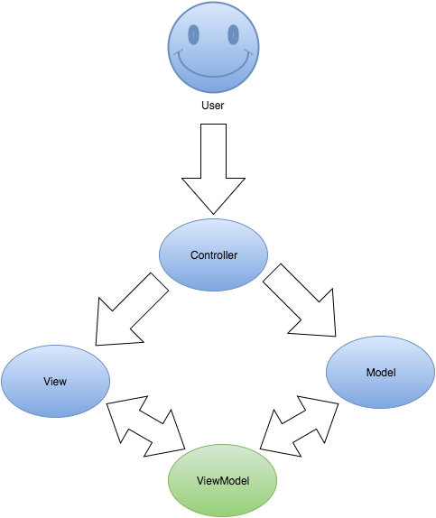

---

layout: viewdata
title: 译文：ViewModel vs ViewData vs ViewBag vs TempData vs Session
date: 2018-07-23 19:59:22
categories:

- C# 
tags: 
- C#

---

> ViewModel vs ViewData vs ViewBag vs TempData vs Session
> 
> 何时使用 ViewModel,ViewData,ViewBag,TempData,Session？
> 
> 它们之间有何区别？

## ViewModel

ViewModel 是 ASP.NET MVC 中的强类型，它表示一个或多个数据模型或数据表中的数据，以呈现 ASP.NET MVC 中的特定视图。它可以将数据形成单个源，例如数据库中的表或多个表，或者只是一个数据或字符串。从本质上讲，ViewModel 是MVC 中 Model 与 View 之间的桥梁。

ViewModel 具备所需的所有验证规则，范围等。因此，视图中的代码是整洁的可维护的。

由于ViewModel 是强类型，因此在编译期间提供错误检查。



## ViewData

ViewData 从`System.web.Mvc.ViewDataDictionary` 类派生的未键入的键值字典。

用于Controller（控制器）和 View（视图）之间传递数据。在控制器中，ViewData 填充数据然后在视图中检索。ViewData 的生命周期仅存于当前请求。即它在控制器中启动并在渲染视图后完成。


```csharp
// Populating ViewData in Controller
public ActionResult Index()
{
    ViewData[&amp;quot;SomeKey&amp;quot;] = &amp;quot;Some Data&amp;quot;;

    return View();
}

// Retriving ViewData value in the view
@ViewData[&amp;quot;SomeKey&amp;quot;].ToString()
```

## ViewBag

ViewBag 是一个动态对象，派生自`System.Web.Mvc.ControllerBase.ViewBag`，它是 ViewData 的包装器。正因为是一个动态对象，所以它没有预先定义任何属性，可以在控制器中创建和填充 ViewBag 动态对象。使用相同的属性名称在视图中检索数据。


```csharp
// Populating ViewBag in Controller
public ActionResult Index()
{
    ViewBag.SomeProperty = &amp;quot;Some Value&amp;quot;;

    return View();
}

// Retriving ViewBag value in the view
@ViewBag.SomeProperty.ToString()
TempData
```

## TempData

TempData 对象派生自`System.Web.Mvc.TempDataDictionary` 类。是一个为键入的键值对字典对象。

TempData 的生命周期从一个请求跨越到另一个请求。即仅当呼叫从当前action method 重定向到另一个 action method，数据才会持续存在。一旦在重定向的 action method 中使用该对象，该对象将自动销毁。通常TempData 存储少量数据，例如从一个action method 到另一个 action method 的 error eessage。

如果你想在第一次重定向后将数据保留在TempData 中，则必须使用TempData.keep()方法保留数据以进一步重定向。

TempData 将其内容存储在 ASP.NET Session 中，因此在使用TempData 时应该谨慎些。就像 Session 一样，TempData会在 webfarm（服务集群）环境中使用中产生问题。您可能需要将**会话状态模式** 设置为**进程外**以使其正常工作。不推荐在Webfarm 中使用TempData。

```csharp
// Populating TempData in Controller
public ActionResult Index()
{
    TempData[&amp;quot;ErrorMsg&amp;quot;] = &amp;quot;Some Error Here&amp;quot;;

    return RedirectToAction(&amp;quot;Error&amp;quot;);
}

// Retriving TempData value in redirected action method
public ActionResult Error() 
{     
    var msg = TempData[&amp;quot;ErrorMsg&amp;quot;];
    // Do Something
}
```

## Session

Session 键值对对象，派生自`System.Web.SessionState`用于跨控制器传递数据。session 的生命周期一直持续到**time out** 或使用**clear、removeall、abandon**方法或用户关闭浏览器强制销毁。作为一种好的做法，尽量减少session 的使用。同样 session 在webfarm 环境中不可靠。解决办法实将"Session State Mode"设置在进程外。

```csharp
// Populating session
public ActionResult Index()
{
    Session[&amp;quot;SomeKey&amp;quot;] = &amp;quot;Some Value&amp;quot;;

    return RedirectToAction(&amp;quot;Error&amp;quot;);
}

// Retriving session value 
public ActionResult Error() 
{     
    var msg = Session[&amp;quot;SomeKey&amp;quot;];
    // Do Something
}
```

## 它们之间的比较

| No  | ViewModel                                     | ViewData                              | ViewBag                              | TempData                                                                                               | Session                                                                                             |
| --- | --------------------------------------------- | ------------------------------------- | ------------------------------------ | ------------------------------------------------------------------------------------------------------ | --------------------------------------------------------------------------------------------------- |
| 1   | 是一个类，它是特定与渲染视图的模型。                            | 是一个键值字典，派生自，ViewDataDictionary        | 是一个动态属性，也是ViewData的包装器               | 是一个键值对字典派生自，TempDataDictionary                                                                         | 是一个键值对字典派生自，TempDataDictionary                                                                      |
| 2   | 强类型，不需要类型转换。                                  | 非类型化。因此，需要为复杂数据进行类型转换。                | 不需要类型转换                              | 未键入：需要复杂数据类型的类型转换。                                                                                     | 未键入：需要类型转换和空检查。                                                                                     |
| 3   | 仅表示呈现视图所需的模型中的数据。                             | 用于在控制器和视图之间传递数据。                      | 用于在控制器和视图之间传递数据。                     | 用于在请求之间传递数据。也就是说将数据从一个控制器传递到另一个控制器是有帮助的                                                                | 用于在访问网站的用户期间存储少量数据                                                                                  |
| 4   | 生命周期仅适用于当前的请求。                                | 生命周期仅适用于当前的请求。                        | 生命周期仅适用于当前的请求。                       | 生命周期用于当前和后续请求。使用TempData.Keep（）方法可以将TempData的生命周期增加到第一次重定向之外。                                          | 会话的生命周期一直持续到服务器或用户强行销毁为止。                                                                           |
| 5   | 在重定向时，ViewModel对象将被销毁。                        | 在重定向时，ViewData中的值变为Null。              | 在重定向时，ViewData中的值变为Null。             | 存储在TempData中的数据仅在重定向期间保留。                                                                              | 存储在Session中的数据在任意数量的重定向期间都会持续存在。                                                                    |
| 6   | 提供编译时错误检查和Intellisense支持。                     | 不提供编译时错误检查。                           | 不提供编译时错误检查。                          | 不提供编译时错误检查。                                                                                            | 不提供编译时错误检查。                                                                                         |
| 7   | 在webfarm（服务器集群）环境中使用ViewModel是安全的，因为它们不依赖于会话。 | ViewData在webfarm环境中使用是安全的，因为它们不依赖于会话。 | 在webfarm环境中使用ViewBag是安全的，因为它们不依赖于会话。 | TempData在具有服务器集群的webfarm中不可靠，因为TempData使用ASP.NET Session进行存储。解决方法是将会话状态模式设置为进程外，并使存储在TempData中的数据可序列化。 | session 在web中不可靠，因为它们存储在服务器的内存中。在webfarm方案中，如果会话由服务器创建并且返回请求转到群集中的另一个服务器，则会话将丢失。解决方法是将会话状态模式设置为进程外。 |

用途上的比较

ViewModel ：

（a）在具有主子关系的表中显示数据。

（b）汇总和汇总的报告。 

（c）在表格中分页数据。 

（d）灵活，来自多个数据源的非常简单和高度复杂的数据。

ViewData：

（a）传递数据列表以呈现下拉列表。 

（b）传递要在视图中呈现的少量数据。 

（c）不适合涉及多个数据源的复杂数据。

ViewBag：

（a）传递数据列表以呈现下拉列表。 

（b）传递要在视图中呈现的少量数据。 

（c）不适合涉及多个数据源的复杂数据

TempData:

（a）用于存储一次性消息，如错误消息和验证消息。 

（b）用于将小数据从一个操作传递到另一个操作或一个控制器调用另一个控制器调用的方案。

Session:

（a）检查用户是否登录到网站。

（b）存储用户的许可信息。

## 总结

1. 使用**ViewModel**而不是ViewData和ViewBag。由于ViewModel在Visual Studio IDE中提供了编译时错误检查和智能感知支持，因此代码将是干净的，并且不易出错。
2. 使用**TempData**进行错误处理。在捕获和异常或错误时，使用TempData将错误详细信息传递到错误页面，以显示正确的错误详细信息。
3. 使用**Session**检查用户的登录状态和权限级别。
4. 如果您的Web应用程序位于webfarm环境中，请尽量避免使用**TempData**和**Session**。
