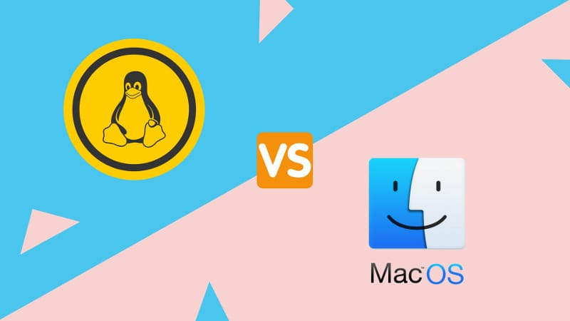

---

title: macOS和Linux内核有何区别
date: 2018-08-01 20:18:01
categories:

- 计算机
tags:
- 译文

---

> 有些人可能会认为 macOS 和 Linux内核之间存在相似之处，因为它们可以处理类似的命令和类似的软件。有些人甚至认为 Apple 的 macOS 基于Linux。事实是，两个内核都有着截然不同的历史和特征。今天，我们来看看 macOS 和Linux 内核之间的区别。

## History of macOS Kernel

我们将从macOS内核的历史开始。1985年，由于首席执行官约翰斯卡利和苹果董事会的失败，史蒂夫乔布斯离开了苹果公司。然后，他成立了一家名为NeXT的新电脑公司。乔布斯希望将一台新计算机（带有新操作系统）快速推向市场。为了节省时间，NeXT团队使用了 Carnegie Mellon 的Mach内核和部分BSD代码库来创建NeXTSTEP操作系统。

NeXT从来没有取得过财务上的成功，部分归功于乔布斯花钱的习惯，就像他还在苹果公司一样。与此同时，Apple曾多次试图更新其操作系统，甚至与IBM合作。1997年，Apple以4.29亿美元收购了NeXT。作为交易的一部分，史蒂夫乔布斯回到了Apple，NeXTSTEP成为了macOS和iOS的基础。

## History of Linux Kernel

与macOS内核不同，Linux不是作为商业努力的一部分而创建的。相反，它是由芬兰计算机科学专业学生Linus Torvalds于1991年创建的。最初，内核是按照Linus计算机的规格编写的，因为他想利用其新的80386处理器。Linus 于1991年8月向Usenet发布了他的新内核代码。很快，他就收到了来自世界各地的代码和功能建议。次年，Orest Zborowski将X Window系统移植到Linux，使其能够支持图形用户界面。

在过去的27年中，Linux已经慢慢增长并获得了功能。这不再是学生的小型项目。现在它运行着世界上 大多数的计算设备和世界上的超级计算机。

## Features of the macOS Kernel

macOS内核官方称为XNU。该缩写代表“XNU不是Unix。”根据苹果的 [Github](https://github.com/apple/darwin-xnu)，XNU是“一个混合内核，将卡耐基梅隆大学开发的 Mach 内核与 [FreeBSD](https://en.wikipedia.org/wiki/FreeBSD) 和 C++ API中用于编写驱动程序的组件结合在一起。该代码的BSD子系统部分“通常实现为微内核系统中的用户空间实现”。Mach 部分负责低层次工作，例如多任务处理，受保护的内存，虚拟内存管理，内核调试支持和控制台I / O.

## Features of Linux Kernel

虽然macOS内核结合了微内核（Mach）和单片内核（BSD）的特性，但Linux只是一个单片内核。一个单内核负责管理CPU，内存，进程间通信，设备驱动程序，文件系统和系统服务器调用.

## Difference between Mac and Linux kernel in one line

macOS内核（XNU）比Linux更长，并且基于两个甚至更旧代码库的组合。另一方面，Linux是更新的，从头开始编写，并且在更多设备上使用
