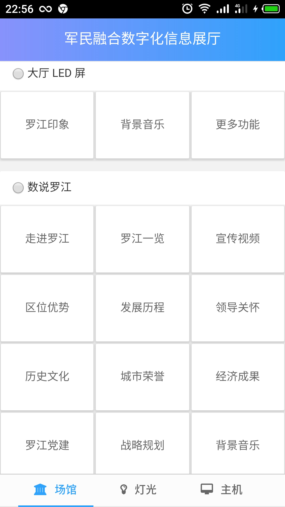

# webapp 中的 meta 标签 

> 近期接到一个需求，需要在移动终端来控制大屏和拼接屏展示内容、以及展厅灯光（开、关）、主机（关机、重启）。

功能比较简单单一，也就没想做原生的APP（IOS、Andorid）毕竟精力有限，索性就用 webapp 来完成。

客户端主要采用 websocket 与服务端 socket 进行通信，网页及功能都已经做完了，用手机浏览器测试了一下功能都没问题，美中不足的是让界面看起来像原生的就更好了，现在移动端主流的浏览器（QQ、UC、Chrome、Safari) 都支持将网页添加到主屏幕，每个浏览器对应的 meta 标签各有不同。

## webapp meta 标签

```html
    <meta charset="utf-8">
    <meta http-equiv="X-UA-Compatible" content="IE=edge,chrome=1">
    <meta name="renderer" content="webkit">
    <!-- 禁止百度转码 -->
    <meta http-equiv="Cache-Control" content="no-siteapp" />
    <meta name="viewport" content="width=device-width , initial-scale=1.0, minimum-scale=0.5, maximum-scale=1.5,user-scalable=yes">
    <meta name="keywords" content="">
    <meta name="description" content="">
    <meta name="author" content="">
    <meta name="robots" content="index,follow">
    <!-- 这个是让网站加入QQ登录接口， -->
    <meta property="qc:admins" content="24614436777641413656375" />
    <!-- safari 隐藏或显示工具栏和菜单栏|标题|状态栏颜色 -->
    <meta name="apple-mobile-web-app-capable" content="yes" />
    <meta name="apple-mobile-web-app-title" content="标题">
    <meta name="apple-mobile-web-app-status-bar-style" content="black-translucent" />

    <meta name="apple-itunes-app" content="app-id=626144601, ct=smart-banner-dd&pt=544309">
    <link rel="shortcut icon" href="favicon.ico">
		<!--safari 添加到主题到桌面的图标-->
    <link rel="apple-touch-icon" sizes="72x72" href="touch-icon-ipad.png" />
    <link rel="apple-touch-icon" sizes="114x114" href="touch-icon-iphone-retina.png" />
    <link rel="apple-touch-icon" sizes="144x144" href="touch-icon-ipad-retina.png" />
    <link rel="apple-touch-icon" href="touch-icon-iphone.png" />
    <!-- Android Lollipop 用来控制选项卡颜色-->
    <meta name="theme-color" content="#5f7fb0">
    <!-- win8 磁贴颜色|winphone 系统a、input 标签背点击时产生的半透明灰色背景-->
    <meta name="msapplication-TileColor" content="#5f7fb0"/>
    <meta name="msapplication-tap-highlight" content="no">
    <!-- 将网页固定到Windows开始菜单时IE 11会自动读取该文件的内容-->
    <meta name="msapplication-config" content="none"/>
    <!-- 针对手持设备优化，主要是针对一些老的不识别viewport的浏览器 -->
    <meta name="HandheldFriendly" content="true">
    <!--  微软的老式浏览器 -->
    <meta name="MobileOptimized" content="320">
    <!-- uc 竖屏|全屏|应用 -->
    <meta name="screen-orientation" content="portrait">
    <meta name="full-screen" content="yes">    
    <meta name="browsermode" content="application">
    <!-- QQ 竖屏|全屏|应用-->
    <meta name="x5-orientation" content="portrait">
    <meta name="x5-fullscreen" content="true">
    <meta name="x5-page-mode" content="app">
    <meta name="viewport" content="width=device-width, initial-scale=1.0, user-scalable=no">
```

## 效果图


