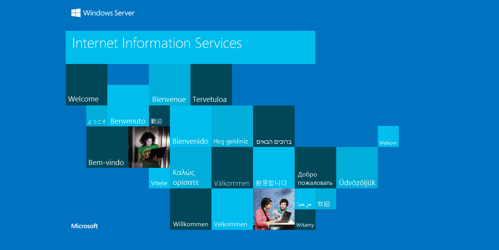

---

title: 使用IIS中的URL重写模块从HTTP重定向到HTTPS
date: 2018-08-23 22:12:43
categories: 

- web
tags:
- iis
- https

---



在大多数情况下，重定向用于以下两个原因之一：

1. 将用户从http重定向到https以强制执行SSL通信。

2. 重定向具有过时URL的用户，通常在服务器场迁移或升级期间更改名称时。

# 从 HTTP 重定向到 HTTPS

一、下载并安装URL重定向模块

URL 重写模块下载地址[URL Rewrite](https://blogs.technet.microsoft.com/dawiese/2016/06/07/redirect-from-http-to-https-using-the-iis-url-rewrite-module/)


二、 确保正在使用的站点已经配置80端口


三、 创建 URL 重写规则，填写规则名称。


四、添加条件，条件输入=`{HTTPS}`，检查输入字符串是否 = 与模式匹配，模式=off


五、编辑操作，操作类型=重定向，重定向URL=`https://{HTTP_HOST}{REQUEST_URI}`，重定向类型= 永久301


六、禁用规则后再启用规则，在IIS管理器窗口右侧面板。


七、URL重写规则将写入您正在使用的站点的web.config文件。例如，上述配置应导致添加到web.config文件：

```xml
<?xml version="1.0" encoding="UTF-8"?>
<configuration>
    <system.webServer>
        <rewrite>
            <rules>
                <rule name="http to https" enabled="true" patternSyntax="Wildcard" stopProcessing="true">
                    <match url="*" />
                    <conditions>
                        <add input="{HTTPS}" pattern="off" />
                    </conditions>
                    <action type="Redirect" url="https://{HTTP_HOST}{REQUEST_URI}" />
                </rule>
            </rules>
        </rewrite>
    </system.webServer>
</configuration>
```

# 参考文献

https://blogs.technet.microsoft.com/dawiese/2016/06/07/redirect-from-http-to-https-using-the-iis-url-rewrite-module/
